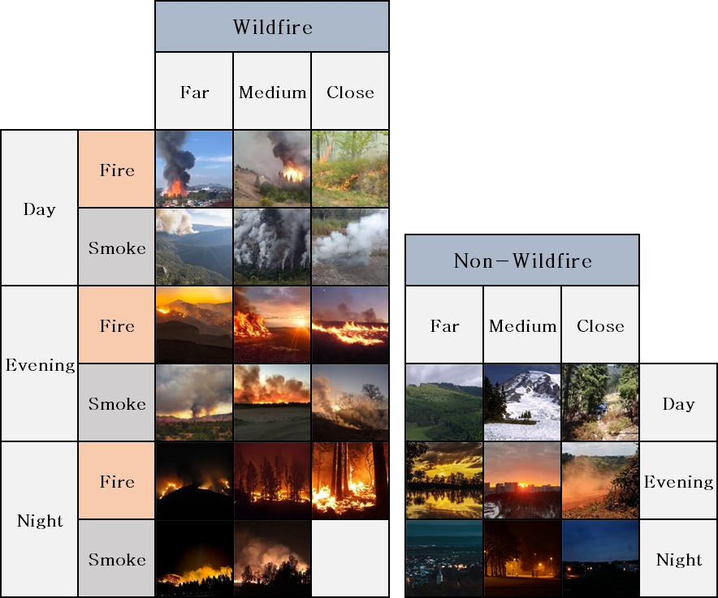

# Wildland-Urban Interface Fire Detection Dataset

The Wildfire Detection Dataset is developed to support research on early wildfire detection, especially in Wildland-Urban Interface (WUI) areas. It contains diverse labeled images categorized by wildfire presence, time of day, distance, and visual features (fire or smoke). The dataset aims to enhance machine learning models deployed on resource-constrained devices, enabling real-time wildfire detection in critical environments.

This dataset includes images captured from public domain sources, open datasets, and manually captured photographs. The images are carefully curated and categorized to ensure balance across different environmental and visual conditions.

## Dataset strucutre

The dataset is organized into a hierarchical folder structure based on five levels:

```plaintext
Root/
 ├── wildfire/
 │    ├── day/
 │    │    ├── close/
 │    │    │    ├── fire/
 │    │    │    ├── smoke/
 │    │    ├── medium/
 │    │    ├── far/
 │    ├── night/
 │    ├── evening/
 ├── non-wildfire/
      ├── day/
      ├── night/
      ├── evening/
```

Each folder contains images representing the respective conditions, ensuring a fine-grained categorization.

| **Layer** | **Description**                                     |
| --------- | --------------------------------------------------- |
| 1st       | Presence (wildfire / non-wildfire)                  |
| 2nd       | Time of Day (day / evening / night)                 |
| 3rd       | Distance (close / medium / far) — only for wildfire |
| 4th       | Visual Content (fire / smoke) — only for wildfire   |

## Example Images



## Download

The dataset can be downloaded here:

📥 [WUI Fire Detection Dataset](https://drive.google.com/drive/folders/13eOsOgSBPeeDJjR-8EenAvtf2L3X8c5l?usp=drive_link)

## License

License

This dataset is licensed under the MIT License.

You are free to:

-   Use the dataset for any purpose
-   Modify the dataset
-   Distribute it
-   Sell copies of the dataset

<!-- # Citation

If you use this dataset in your research, please cite the following paper:

```bibtex
@article{les2dataset,
  title={A Dataset for Wildfire Detection in Wildland-Urban Interface Areas},
  author={Les2, A. and Garcia, J. and Garcia, M. and Garcia, J. and Garcia, J. and Garcia, J.},
  journal={arXiv preprint arXiv:2401.00001},
  year={2024}
}
``` -->
